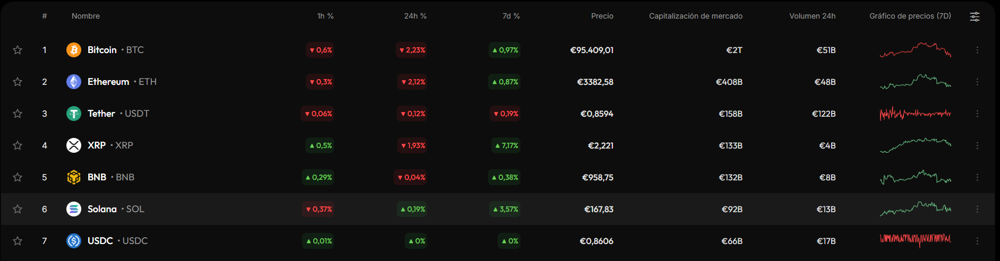
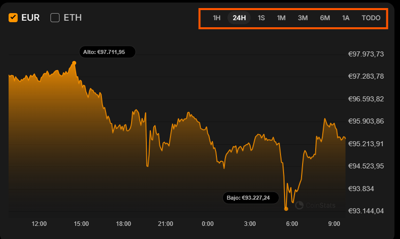
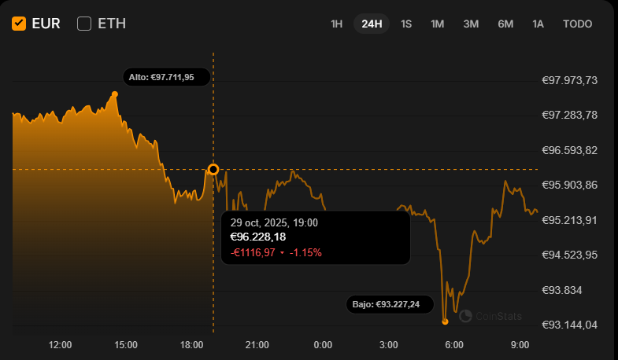

# 📘 Ejemplo de Aplicación

## 📝 Descripción general

En este documento analizaremos un ejemplo de aplicación que cumple los requisitos que se piden en la tarea.

Concretamente la web de [CoinStats](https://coinstats.app/es/), que proporciona información actualizada sobre criptomonedas. La finalidad es servir como referencia para diseñar una web que consuma una API, mostrando datos de forma interactiva y con una buena experiencia de usuario.

---

## 🛠️ Análisis de Ejemplo

#### 1. Resumen

La página de *[Resumen](https://coinstats.app/es/coins/)* actuará como punto de entrada a la aplicación. En este caso, se muestra un ranking de las criptomonedas más populares junto con algunos indicadores clave.

**Elementos Destacados:**

- <u>Ranking inicial</u>: lista de criptomonedas principales, ordenadas por capitalización de mercado.

- <u>Indicadores</u>: precio actual, variación porcentual del precio para diferentes [*timeframes*](https://vantofx.com/es/academy/what-is-timeframe-in-trading/), acceso al gráfico de precios etc.

---

#### 2. Visualización de Datos

La página de *[Visualización de Datos](https://coinstats.app/es/coins/bitcoin/)* muestra información detallada sobre una criptomoneda seleccionada en la página de Resumen. Básicamente es una página de ampliación de información.

**Elementos Destacados:**

- <u>Gráfico interactivo:</u> se muestra la evolución del precio a lo largo del tiempo, 

- <u>Timeframe</u>: en la barra de la parte superior derecha seleccionando una de las opciones el gráfico se actualiza.

- <u>Información de Precio</u>: colocando el puntero sobre el gráfico muestra información de precio, *timestamp* etc. para ese momento concreto. 

---

#### 3. Funcionalidad Extra

En este apartado te muestro algunos ejemplos de funcionalidad extra para que puedas tener como referencia. Te dejo algunos ejemplos que puedes consultar en la página analizada 

- <u>Favoritos</u>: en el ranking, pulsando la estrella de la parte izquierda se asigna el activo a favoritos y lo muestra en una [lista.](https://coinstats.app/es/favorites/)

- <u>Barra superior:</u> en la parte superior del gráfico, se incluyen diferentes categorías con información relevante como [noticias relacionadas.](https://coinstats.app/es/coins/bitcoin/news/)

- <u>Filtro de Ordenación</u>: en el ranking de activos, al clicar sobre alguno de los elementos: *#, Nombre, Precio,* ordena la lista en función a ese criterio. 
